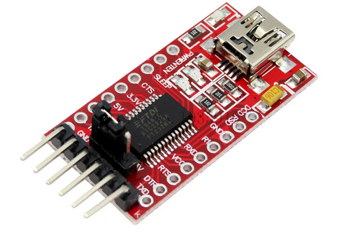
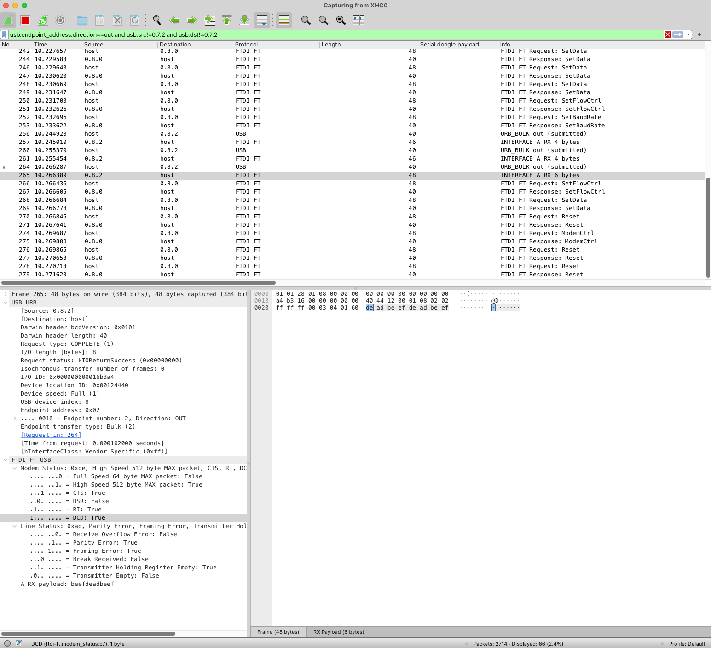
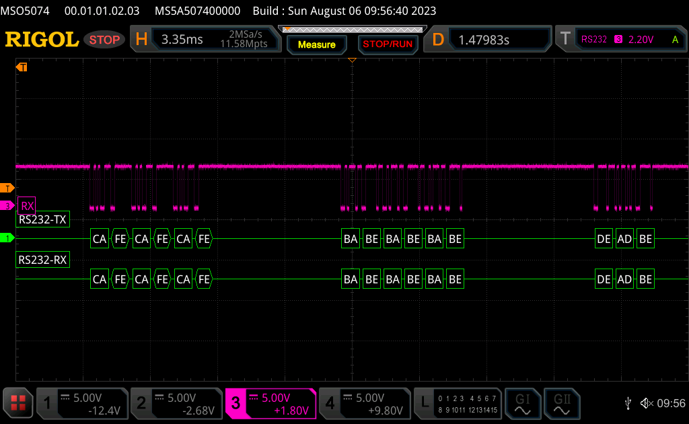

# Reproducer for cheap FTDI dongle and serialport-rs



This bug has [the dongle](https://www.aliexpress.com/item/4001105371136.html) not sending the last few bytes on a series of transmissions. This is meant to be a small reproducer for [this serialport-rs Matrix.org channel discussion](https://matrix.to/#/!cnJwoUGZmLziNcGNua:matrix.org/$2d_Wiu_tC6DfOJT4YCWo-e5nCUlHamFjczpXgIFBGko).

I suspect it's related with the final FTDI URB "Reset" command being sent and reaching the device (see the `ftdi_urb_capture.pcapng.gz` for the actual USB packets) before the last bytes transfer is able to finalise (see highlighted URB_BULK out (completed) packet):



The wireshark capture above is the same on each experiment, what changes though is the actual output sent out on the TX pins of the dongle, as depicted by the oscilloscope:



When a wait is set after the last payload (`deadbeef deadbeef` in our case):

```diff
diff --git a/src/main.rs b/src/main.rs
index 9e66357..0a28d11 100644
--- a/src/main.rs
+++ b/src/main.rs
@@ -25,7 +25,13 @@ fn main () -> Result<(), Box<dyn Error>> {
        port.write(&bar)?;
        wait(CMD_WAIT);
        port.write(&baz)?;
+       // Uncomment this and the last packet gets sent successfully
+       //
+       //wait(CMD_WAIT);
+       //
+       // None of the following work well to substitute the above wait(CMD_WAIT):
+       // port.flush()?;
+       // drop(port);
 
        Ok(())
 }
 ```

All is good:

