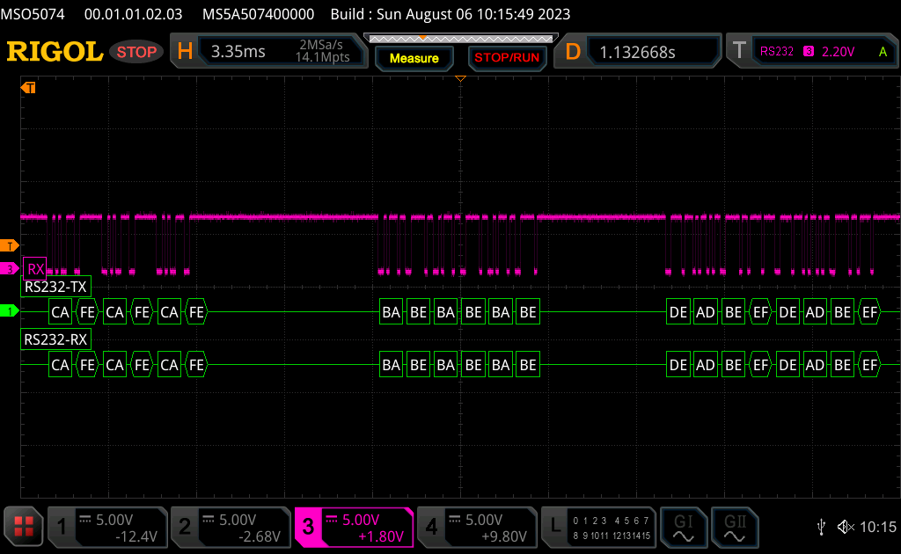

# Reproducer for cheap FTDI dongle and serialport-rs

## A typical Aliexpress FTDI clone


This bug has [the dongle](https://www.aliexpress.com/item/4001105371136.html) not sending the last few bytes on a series of transmissions. This is meant to be a small reproducer for [this serialport-rs Matrix.org channel discussion](https://matrix.to/#/!cnJwoUGZmLziNcGNua:matrix.org/$2d_Wiu_tC6DfOJT4YCWo-e5nCUlHamFjczpXgIFBGko).

I suspect it's related with the final FTDI URB "Reset" command being sent and reaching the device (see the `ftdi_urb_capture.pcapng.gz` for the actual USB packets) before the last bytes transfer is able to finalise (see highlighted URB_BULK out (completed) packet):


The wireshark capture above is the same on each experiment, what changes though is the actual output sent out on the TX pins of the dongle, as depicted by the oscilloscope:


When a wait is set after the last payload (`deadbeef deadbeef` in our case):

```diff
diff --git a/src/main.rs b/src/main.rs
index 9e66357..0a28d11 100644
--- a/src/main.rs
+++ b/src/main.rs
@@ -25,7 +25,13 @@ fn main () -> Result<(), Box<dyn Error>> {
        port.write(&bar)?;
        wait(CMD_WAIT);
        port.write(&baz)?;
+       // Uncomment this and the last packet gets sent successfully
+       //
+       //wait(CMD_WAIT);
+       //
+       // None of the following work well to substitute the above wait(CMD_WAIT):
+       // port.flush()?;
+       // drop(port);
 
        Ok(())
 }
 ```

All is good:



Refer to [commit 48be1fd to reproduce those conditions](https://github.com/brainstorm/serialport-rs-reproducer/commit/48be1fd7ff568c7e8e68cb8ca7175c411d06af21) with this particular dongle, purchased in [this particular Aliexpress store](https://tzt123.aliexpress.com/store/2347088) on `2017-02-27`.

# A Silabs CP2102 dongle

With [this dongle](https://www.aliexpress.com/item/32694152202.html), everything works fine out of the box:


Meaning, no wait/delay needs to be introduced on the last command:


And no delays are needed to be introduced in between commands whatsoever:


```diff
diff --git a/src/main.rs b/src/main.rs
index 0a28d11..a6af187 100644
--- a/src/main.rs
+++ b/src/main.rs
@@ -1,14 +1,9 @@
-use std::{error::Error, thread::sleep, time::Duration};
+use std::error::Error;
 use hex_literal::hex;
 
 // Settings
-const PORT: &str = "/dev/cu.usbserial-00000000";
+const PORT: &str = "/dev/cu.usbserial-0001";
 const BAUD: u32 = 9600;
-const CMD_WAIT: usize = 10;
-
-fn wait(milis: usize) {
-       sleep(Duration::from_millis(milis as u64));
-}
 
 fn main () -> Result<(), Box<dyn Error>> {
        let foo= hex!("ca fe ca fe ca fe");
@@ -19,19 +14,9 @@ fn main () -> Result<(), Box<dyn Error>> {
                .flow_control(serialport::FlowControl::Software)
                .open()?;
 
-       wait(CMD_WAIT);
        port.write(&foo)?;
-       wait(CMD_WAIT);
        port.write(&bar)?;
-       wait(CMD_WAIT);
        port.write(&baz)?;
-       // Uncomment this and the last packet gets sent successfully
-       //
-       //wait(CMD_WAIT);
-       //
-       // None of those work to substitute the above wait(CMD_WAIT):
-       // port.flush()?;
-       // drop(port);
 
        Ok(())
 }
```